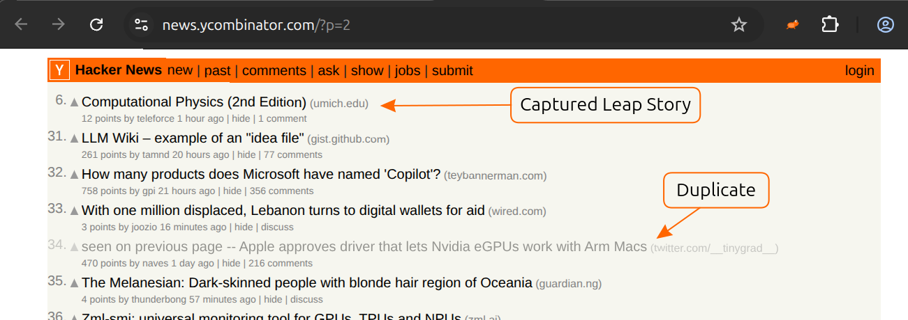

# LeapStories

> [!CAUTION]
> **AI Disclosure** This project was initially written by AI (Primarily Claude Opus 4.6). See docs/plans* for reviewed plans and docs/PROMPT_HISTORY.md for an attempt at capturing "cleaned up" prompts (it unfortunately reads more like a log). Once "complete", the core script content was reviewed and refactored under closer human inspection and direction. AI was more heavily relied on for proper manifest content and overall extension structure, though these were still briefly reviewed for permissions and security. The firefox build was also heavily AI driven. I am a professional developer with experience in web, but not (much in recent) web extension development. Thus overall, AI enabled a quick web extension build for multiple targets (firefox, chrome) without web extension expertise.

Browser extension that catches Hacker News stories missed between page navigations.



## The problem

When browsing HN, stories shift rank constantly. By the time you finish page 1 and click "More," some stories that were on page 2 may have risen into page 1's range. They disappear from page 2 entirely — you never see them.

## How it works

LeapStories records which stories you saw on each page. When you navigate to the next page, it silently re-fetches the previous page, compares it against your original snapshot, and injects any stories that rose into the gap at the top of your current page. Stories that fell from the previous page and appear as duplicates are dimmed. The extension intentionally attempts to introduce no, or minimal of its own styling.

## Install

### Chrome Web Store (recommended)

> **Coming soon** — submitted and awaiting review.

<!--
[Install from Chrome Web Store](https://chrome.google.com/webstore/detail/leapstories/EXTENSION_ID)
-->

## Options

Right-click the extension icon → **Options** (or go to `chrome://extensions` → LeapStories → **Details** → **Extension options**).

| Setting | Default | Description |
|---|---|---|
| Duplicate story prefix | `seen on previous page — ` | Text prepended to titles of stories already seen on the previous page |
| Duplicate story opacity | `0.4` | Opacity applied to dimmed duplicate story rows (0–1) |
| Dwell time (seconds) | `60` | Minimum seconds on a page before gap detection activates on the next page |

Duplicate rows also get the `.leapstories-duplicate` CSS class, so you can target them with your own HN user stylesheet.

## Scope

Currently targets only the default top stories listing (`/` and `/news`). Does not run on `/newest`, `/front`, `/ask`, `/show`, or other pages.

## Development

### Manual Install (developer mode)

1. Open `chrome://extensions`
2. Enable **Developer mode** (top right)
3. Click **Load unpacked** and select this project directory

### Verify

1. Go to https://news.ycombinator.com
2. Click "More" to go to page 2 (wait at least 60 seconds default dwell time)
3. If any stories shifted between your page 1 visit and now, they'll appear at the top of page 2

### Testing

```bash
node test/test.js # Automated test suite — uses local fixtures, no live network
node test/demo.js # Visual demo — simulates gap stories and leaves browser open for inspection
node test/open.js # Manual testing — opens browser with extension loaded
```

Requires [Playwright](https://playwright.dev/) (`npm install`). Tests use Playwright route interception to serve synthetic and captured HTML fixtures — no connection to live HN.

## Privacy

LeapStories does not collect, transmit, or share any user data. All data is stored locally:

- **Preferences** (chrome.storage.local): duplicate prefix, opacity, dwell time
- **Page snapshots** (chrome.storage.session): story IDs and timestamps, cleared when the browser closes

The only network requests the extension makes are to `news.ycombinator.com` to re-fetch the previous page for gap detection. No analytics, no tracking, no external servers.

